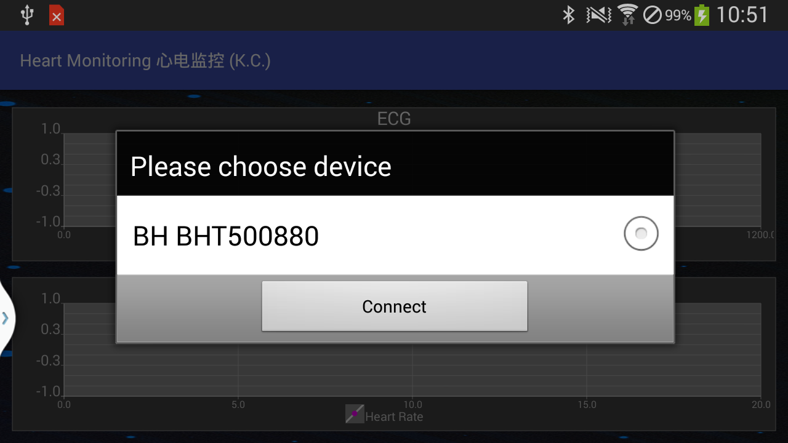
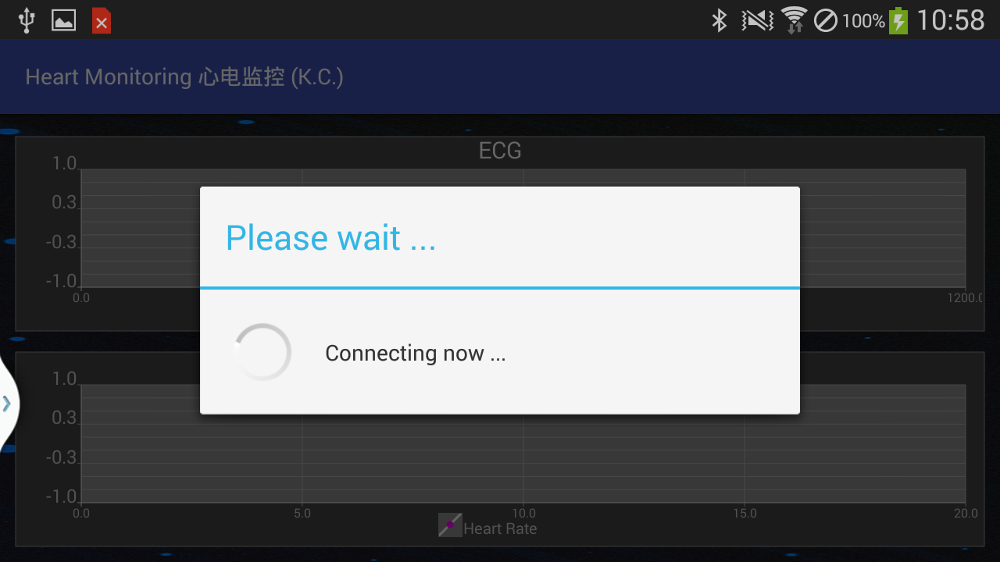

# Wearable-Sensor-App
Plot signals from Biopatch on Android phone at real time. 

### Dependencies
- Androidplot-core-0.6.1

#### More
- [x] connect sensor using Bluetooth
- [x] transmit signals from sensor to phone
- [x] plot signals at real-time on phone
- [ ] process signals to improve signal quality
- [ ] upgrade jar to aar

##### Reference
[1] K. Chen, W. Fink, J.M. Roveda, et al., "Wearable Sensor Based Stress Management Using Integrated Respiratory and ECG Waveforms", IEEE 12th International Conference on Wearable and Implantable Body Sensor Networks (BSN), 2015.  
